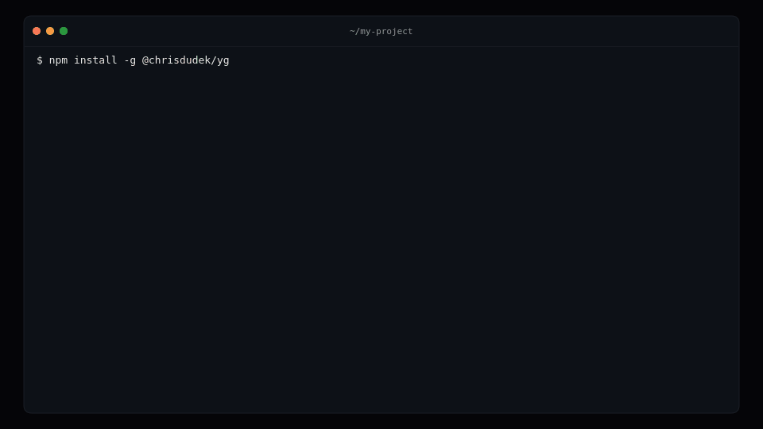
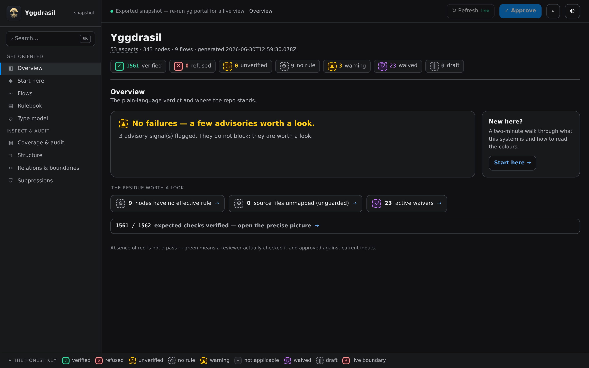

<p align="center">
  
</p>

# Yggdrasil

**Stop babysitting your agent.**

AI agents write your code now. Yggdrasil checks their work the moment they write it, against rules you set, so code that breaks your rules never reaches your review. The check runs inside the agent's loop: it writes, Yggdrasil checks, and on a failure the agent gets a precise error and has to fix it before it moves on. The same check runs in CI, for free, with no API keys. Works with Claude Code, Cursor, Copilot, Codex, Cline, and more.

And a green build can't quietly lie: every rule was actually checked against the exact code that's shipping, and CI re-proves it for free — no keys, no model calls.

Call it **guardrails your agent can't bypass**, policy-as-code for coding agents, or a drift gate for your architecture — the idea is the same: your rules, enforced.

[](https://github.com/krzysztofdudek/Yggdrasil/actions/workflows/ci.yml)
[](https://www.npmjs.com/package/@chrisdudek/yg)
[](https://opensource.org/licenses/MIT)
[](https://codecov.io/gh/krzysztofdudek/Yggdrasil)
[](https://github.com/krzysztofdudek/Yggdrasil)
[](https://github.com/krzysztofdudek/Yggdrasil/discussions)

---

## Why this exists

I built this after watching Claude Code quietly skip audit logging on a payment mutation for the third time. CLAUDE.md said to emit audit events. The agent read it. The agent ignored it. Tests passed. Lint passed. I only caught it because I happened to diff that specific file.

A rules file is a suggestion. This is the reviewer that turns it into a rule.

## The problem

You wrote 200 lines of rules in CLAUDE.md or .cursorrules. Your agent applies maybe 70% of them. The rest it "optimizes away" because it decided they're noise. You tell it again, it does better for a while. Next session, same thing.

Tests pass. Lint passes. The code compiles. But the agent skipped audit logging on a payment mutation, called a service it shouldn't from that layer, used `Date.now()` in a module that must be deterministic.

You find out when you review a PR with 50 changed files. Or you don't.

A rules file is a suggestion. There are no consequences for ignoring it, and no feedback until it's too late.

## Right now, you are the feedback loop

There are three ways to work with an agent:

- **Autocomplete.** It suggests the next line, you write the rest. One small use case.
- **You are the loop.** It generates whole changes, and you check each one, send it back, and check again. This is where the day goes.
- **A full feedback loop.** It runs a real check, reads the failure, and fixes its own work before you look.

Most people are stuck in the middle. The agent got faster, and you turned into its feedback loop.

> [!TIP]
> Yggdrasil moves you to the third. It gives the agent a loop of its own: a real check that runs while it works, reads the failure, and fixes it before you look.

## How it works

Before the agent edits a file, `yg context` gives it only the rules that touch that file. After it edits, `yg check` verifies them. A rule a script can check runs locally, for free, and the agent cannot talk its way past it. A rule that needs judgment goes to a separate model. On a failure the agent gets a specific error, fixes it, and re-checks. This is code review while the agent is working, not after.

A quick example. The rule: every charge records an audit event. The agent writes a refund that skips it:

```ts
async function refund(req) {
  await payments.refund(req.body.chargeId)
  return { ok: true }
}
```

`yg check` refuses it: **refund changes a charge with no audit event.** The agent adds the call, re-runs, and passes:

```ts
async function refund(req) {
  await payments.refund(req.body.chargeId)
  await audit('refund', req.body.chargeId) // added
  return { ok: true }
}
```

You reviewed nothing.

1. The agent is about to edit a file.
2. **`yg context`** hands it only the aspects that touch that file.
3. The agent writes code that targets those rules.
4. **`yg log add`** records why the change happened.
5. **`yg check --approve`** runs the checks. Scripts run locally for free. Rules that need judgment go to the reviewer.
6. A rule fails: *"audit logging missing in charge()."*
7. The agent fixes it and re-runs the check, looping until it is green.
8. The verdict is recorded in the committed lock.
9. In CI, **`yg check`** recomputes the input hashes and passes, with no LLM calls.

Aspects are scoped. The agent only sees the ones that touch the file it's working on, not all 200. One aspect can cover dozens of files. Change an aspect and everything it governs gets flagged for re-verification.

## The pieces: nodes, aspects, flows

You lay the track, the agent drives. Your rules and structure live in a small graph next to your code, under `.yggdrasil/`, with three first-class elements:

- **Nodes** group source files into components.
- **Aspects** are the rules attached to nodes ("Every public endpoint must use rate limiting", "All command handlers must validate input with zod", "No direct database access from this layer"). It's Yggdrasil's own word for an enforceable rule — unrelated to aspect-oriented programming.
- **Flows** mark business processes that span components, so an aspect on a flow reaches every participant.

A rule can apply to one component or many. You attach it once, and the tool computes everywhere it lands. You never copy-paste a rule onto each file. See the [docs](https://krzysztofdudek.github.io/Yggdrasil/) for how that works. **Ports** are the one explicit exception: a bare relation between nodes does not carry an aspect across a component boundary, but consuming a named port does. That keeps inheritance deliberate, never accidental.

## See the whole graph: the portal

The graph is text next to your code. `yg portal` turns it into a picture: a read-only map of your architecture in the browser, showing every component, every rule, and whether each one is actually verified against the code right now. The only green is a check a reviewer ran and approved against the current code, nothing is rounded up.

<p align="center">
  
</p>

Click a rule to read its actual text and every component it lands on; click a component to see why it passed or what it still needs. It runs locally and writes nothing (one explicit approve button aside), or `yg portal --static` writes a single self-contained file you can hand to anyone, no checkout required. See the [portal docs](https://krzysztofdudek.github.io/Yggdrasil/portal).

## Two kinds of rule

Every aspect names its reviewer, and the two are not equal:

- **Deterministic aspects** ship a `check.mjs` that the CLI runs locally at zero LLM cost. It reads the node's source (with a tree-sitter parse tree where the language has a grammar), the file system, and the graph, and returns a list of violations. This is the un-ignorable layer: the script *runs*, every time, deterministically, for free. Exactly the kind of rule an agent quietly drops when it's only a line in CLAUDE.md. A built-in check of the same kind keeps your declared component dependencies honest against the real code. Lean on this layer.

- **LLM aspects** are plain Markdown (`content.md`), for the judgment a script can't make. A separate LLM call, one model verifying another, reads the rule and the node's source, then returns SATISFIED or NOT SATISFIED. It is the higher-variance layer: reserve it for rules that genuinely need reading, keep those nodes small, and stage new ones through `advisory` before you enforce. The rule is just text you write:

  ```markdown
  # Audit every payment mutation

  Any function that creates, updates, or refunds a charge must
  call `auditLog.emit()` before it returns. A mutation with no
  audit event is a refusal.
  ```

An aspect is one or the other, never both.

### Status: draft, advisory, enforced

Status controls how loud a rule is, not what it checks. A `draft` aspect is silent while you author it. An `advisory` aspect runs the reviewer and lists problems as warnings, useful for a sprint or two to gather signal without blocking anyone. An `enforced` aspect blocks `yg check` and CI. Verdicts survive status flips, so promoting advisory to enforced never re-runs the reviewer. See [Aspect Status](https://krzysztofdudek.github.io/Yggdrasil/aspect-status) for the lifecycle.

### When you need finer control

A `when` predicate makes an aspect apply to only a subset of nodes, checked deterministically, before the reviewer is ever called. LLM aspects can pin a named tier (provider, model, temperature) and run the reviewer multiple times to take a majority vote on high-stakes rules. Both are reference-level; see the [docs](https://krzysztofdudek.github.io/Yggdrasil/).

Each node also keeps an append-only `log.md` next to its `yg-node.yaml`. The log captures *why* a change happened, the intent the diff never records. The agent writes entries with `yg log add` and reads prior ones with `yg log read`. A node type can require a fresh entry before a source change is verified. The reviewer never sees the log; the next agent does.

When a genuine exception is needed, an inline `yg-suppress(<aspect-path>) <reason>` waiver exempts a specific location, used sparingly, and only with your explicit sign-off.

## Works on any codebase

**New project:** define rules before writing code. The agent builds the graph structure as it implements features. Every new file is verified from the start.

**Existing project:** map the areas you're actively working on. Everything else stays unmapped until you need it. Coverage grows as you work, not as a day-one setup cost.

## Rules can be anything enforceable

Team conventions. Company standards. ISO compliance. Architecture boundaries. Error handling patterns. Logging formats. If you can describe it in plain language and a reviewer can check it, or express it as a script, Yggdrasil enforces it.

Two honest limits. A rule enforces **structure, not runtime behavior**: it can require that you call the audit utility, not that the audit actually fires in production. And a green check is only as good as the rule behind it. A shallow rule passes shallow code. The enforcement is real. Deciding what is worth enforcing stays yours.

## The Yggdrasil family

Four tools, one thesis: **make an AI coding agent prove correctness, stage by stage**, because "done" isn't done. Each is a checkpoint at a different point in the pipeline. Yggdrasil enforces architecture against the codebase itself. The other three are single Markdown files (installable as a Claude Code plugin or droppable into any agent that reads skills) that check the earlier stages.

| Tool | Stage | What it makes the agent prove |
|---|---|---|
| **Yggdrasil** (this one) | code → architecture | Every change satisfies the rules that govern it, checked before the agent moves on. |
| **[Ratatoskr](https://github.com/krzysztofdudek/RatatoskrSkill)** | request → intent | Keeps the agent talking to you in plain words, not code, so you can follow what it's doing. |
| **[Urd](https://github.com/krzysztofdudek/UrdSkill)** | intent → code | When the spec is ambiguous, it consults the source of truth and asks. It does not guess. |
| **[Researcher](https://github.com/krzysztofdudek/ResearcherSkill)** | code → measured result | Point it at a metric and it runs experiments. Hypotheses kept and discarded. |

## Getting started

**1. Install and init.** Requires Node.js 22+.

```bash
npm install -g @chrisdudek/yg
cd your-project
yg init
```

The wizard walks you through platform selection and reviewer setup (provider, model, and where keys live in `yg-config.yaml` / `yg-secrets.yaml`).

**2. Tell the agent what matters.**

```
You:    "All payment operations must emit audit events."
Agent:  Creates rule, applies it to payment code.

You:    "All API endpoints must validate input with zod."
Agent:  Creates rule, applies it to endpoint handlers.
```

The agent manages the structure. Which rules apply where, which files are mapped, how components relate. You say what should be enforced.

**3. Work normally.**

The agent verifies its own code as it works. When it violates a rule, it gets feedback and fixes it.

**4. Enforce in CI.**

```yaml
- run: npx @chrisdudek/yg check
```

`yg check` is the deterministic gate: it makes no LLM calls and needs no provider config or keys. It recomputes the input hash of every expected pair and compares it against the verdict recorded in the lock, and also validates structure, coverage, and completeness. If code changed without being verified, the pair no longer matches its recorded hash and check fails.

## Supported platforms

Works with any AI coding agent. `yg init` sets up the rules file your agent expects and configures the reviewer.

**Agent platforms:** Cursor, Claude Code, GitHub Copilot, Codex, Cline, RooCode, Windsurf, Aider, Gemini CLI, Amp, OpenCode, CodeBuddy, plus a Generic fallback (`.yggdrasil/agent-rules.md`) for anything not listed. Codex, Amp, and OpenCode all write to a shared `AGENTS.md`, so don't initialize more than one of them at once.

**Reviewer providers:**

- **API:** Anthropic, OpenAI, Google, OpenAI-compatible (require an API key)
- **Local:** Ollama (no API cost; requires a local install)
- **Agent CLI:** Claude Code, Codex, Gemini CLI (delegate to the installed CLI; no API key)

## CLI

`yg` is the single binary. The commands the agent (and you) use most:

- `yg context --file <path>` / `--node <path>`: the aspects effective on a file or node, before editing.
- `yg check`: the deterministic CI gate (verifies recorded verdicts by hash, plus structure, coverage, completeness; no LLM calls, no keys).
- `yg check --approve`: verify every unverified pair (deterministic first, for free; then LLM) and record the verdicts in the lock.
- `yg aspect-test`: run an aspect of either kind against a node or files on demand, including an LLM `--dry-run` prompt preview; never writes the lock.
- `yg log add | read | merge-resolve`: the per-node decision log.
- `yg portal`: a read-only browser view of the whole graph and its current verification state (`--static` writes a self-contained offline file).
- `yg impact`, `yg tree`, `yg find`, `yg aspects`, `yg flows`, `yg owner`, `yg suppressions`, `yg type-suggest`: navigate and query the graph.
- `yg knowledge list | read <name>`: the built-in reference topics (aspects, ports and relations, flows, the lock, and more).

## FAQ

**How is this different from CLAUDE.md or .cursorrules?**
Rules files are flat text dumped into every prompt. No scoping, no verification. Yggdrasil delivers only the rules relevant to each file and reviews the output against them.

**How is this different from an agent hook or a pre-commit hook?**
A hook is a real, free, in-loop gate — and you should use one. Yggdrasil's own deterministic layer (`check.mjs`) *is* exactly that: a script that runs every time and can't be talked past. Point a `PreToolUse` or pre-commit hook at `yg check` and you've wired Yggdrasil into the loop. What a bare hook has no notion of is three things: *which* rule applies to *which* file (Yggdrasil hands the agent only the rules that touch the file it's editing), rules that need judgment rather than a script (the LLM layer), and a content-addressed lock that lets CI re-prove every rule — including an LLM verdict — against the current code for free, with no key. The hook is the trigger; the graph and the lock are what it triggers.

**How is this different from linters?**
Linters check syntax and patterns. "Rate limiting required" isn't a lint rule. "No direct DB access from this layer" isn't in any AST. "All mutations must emit audit events" can't be checked with regex. Yggdrasil reviews against rules that only exist in your head until you write them down. And where a rule *is* mechanically checkable, you can write it as a script that runs for free.

**How is this different from a PR review?**
PR review happens after the code is written. By then the agent has moved on, context is lost, and you're catching up. Yggdrasil reviews while the agent is working, so violations get fixed in the same session.

**Does it work?**
Locally, `yg check --approve` sends LLM aspects to the reviewer and runs script aspects on your machine, then records each verdict in a single committed lock file. `yg check` in CI makes no LLM calls. It recomputes the input hash of every expected pair and compares it against the verdict the lock recorded (and validates structure and coverage). If a PR has unverified changes, the hashes no longer match and CI catches it.

**What if I want to stop?**
Delete `.yggdrasil/` and the rules file. No runtime dependencies, no build hooks, nothing left behind.

**Is this just another AI code review bot?**
No. Review bots hunt for bugs against their own general model of "good code" — and some now run in the CLI or the agent loop too, so timing alone isn't the difference. Yggdrasil checks *your* specific rules, the ones only you know; delivers just the relevant ones per file; and records each verdict in a committed, content-addressed lock that CI re-proves for free with no key. The rules are yours; the durable, keyless proof is what Yggdrasil adds.

## Examples

[`examples/`](examples/) has two projects you can run. One passes, one has a deliberate violation for the reviewer to catch.

This repo uses Yggdrasil on itself. Browse [`.yggdrasil/`](.yggdrasil/) for a real, live graph, or run `yg check` in a clone to see the current node and aspect coverage for yourself.

## Docs

[krzysztofdudek.github.io/Yggdrasil](https://krzysztofdudek.github.io/Yggdrasil/). Start with [How it works](https://krzysztofdudek.github.io/Yggdrasil/how-it-works), then [Getting started](https://krzysztofdudek.github.io/Yggdrasil/getting-started).

## License

MIT

---

<div align="center">
  
  <br/><br/>
  <a href="https://github.com/krzysztofdudek/Yggdrasil/discussions">
    
  </a>
  <br/>
  <sub>Questions? Open a discussion on GitHub.</sub>
</div>
